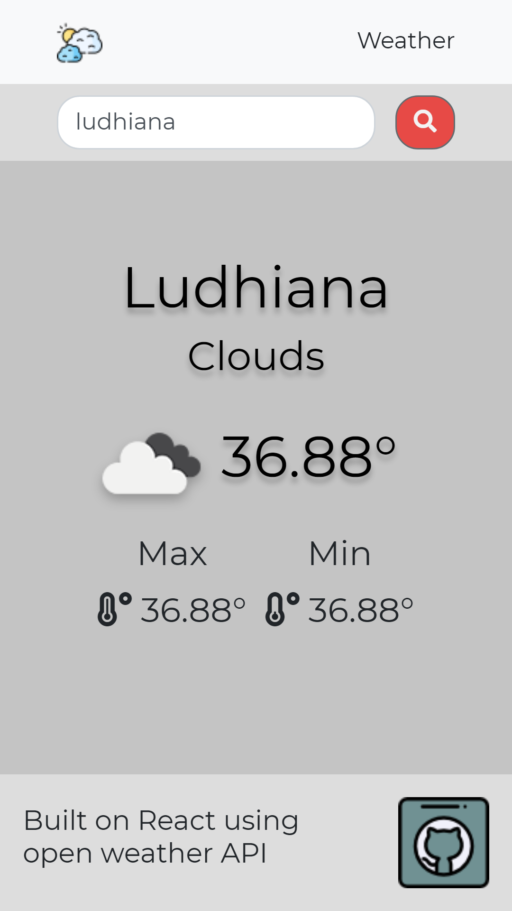

# Weather App

Weather app is for searching current weather, It provides current temp with max and min temperature.

Link [👨‍💻](https://m-weather.netlify.app/)

## Usage

Search the name of city.

## Resources used

- Create react app [🔗](https://reactjs.org/docs/create-a-new-react-app.html)
- OpenWeatherMaps API [🔗](https://openweathermap.org/api)
- Bootstrap [🔗](https://getbootstrap.com/)
- FontAwesome [🔗](https://fontawesome.com/)
- Gsap [🔗](https://greensock.com/gsap/)

## Learning

- Fetch API
- Difference b/w Asynchronous and Synchronous

## License

[MIT](https://choosealicense.com/licenses/mit/)
